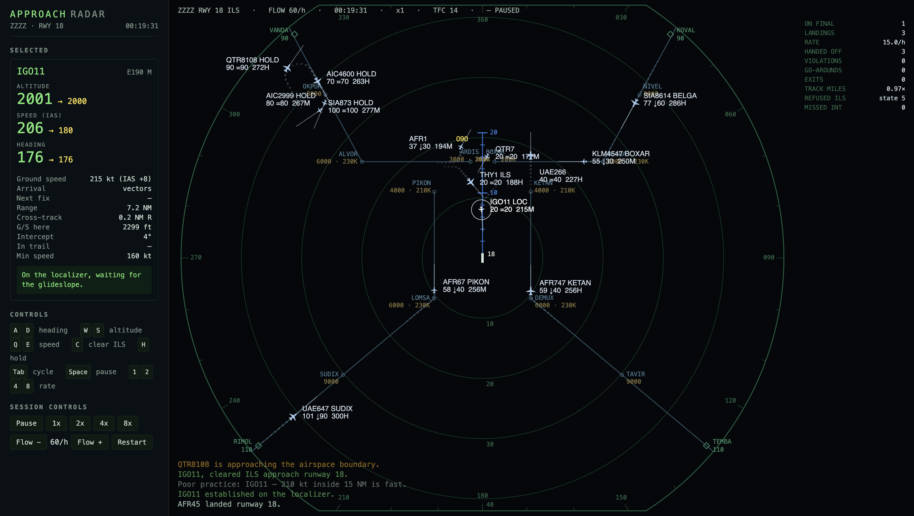
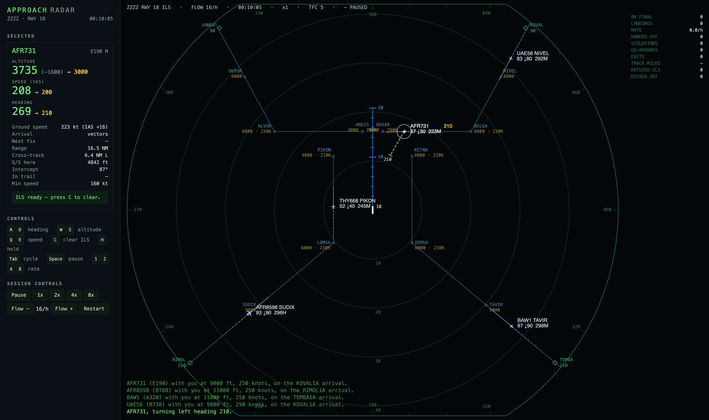
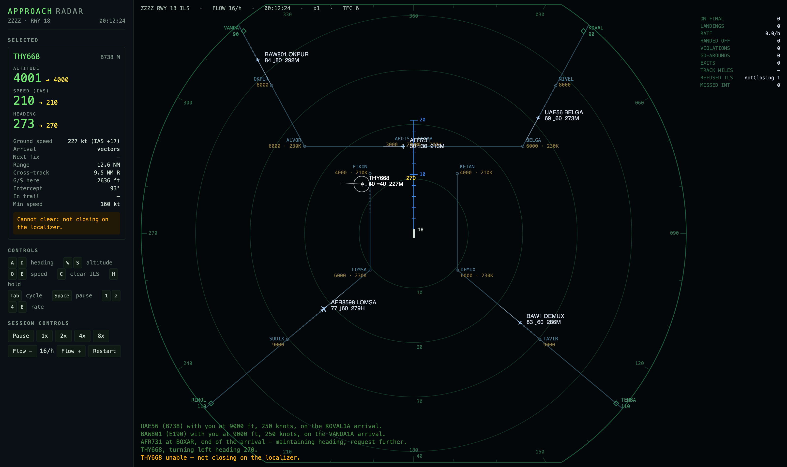
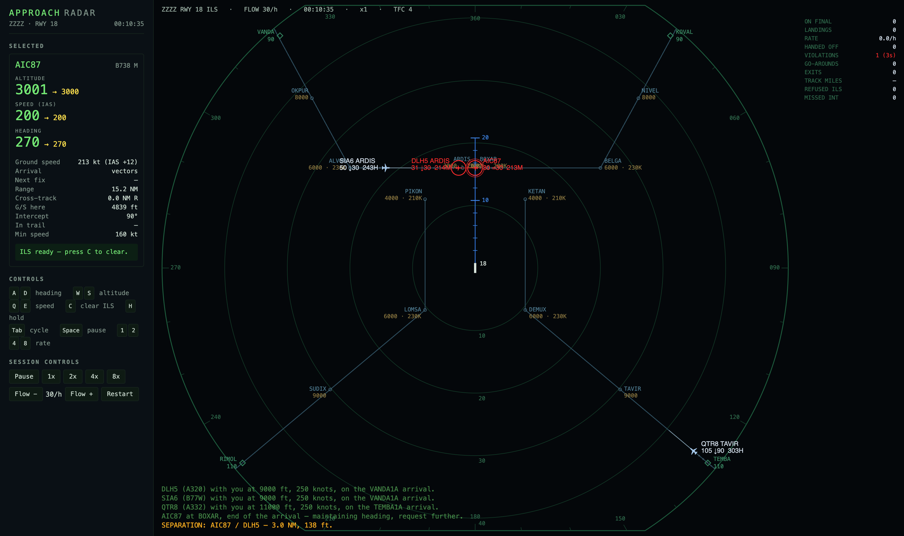

# Approach Radar

**Turn four streams of arrivals into one line of aircraft on the ILS.**

You are the Approach controller at a single-runway field. Center hands you traffic at the edge of a
50 NM circle at 250 knots. Everything after that is yours: vector them, descend them, space them,
and get each one established on the localizer before you hand it to Tower.



*Fourteen aircraft, four of them stacked in the hold at OKPUR because the sequence had no room for
them, one established on the localizer, no violations. That is a good day.*

```bash
nvm use && npm install
npm run dev      # http://localhost:5173
```

No backend, no accounts, no install. A static bundle and a canvas.

---

Nothing snaps. Aircraft take time to turn, take time to come down, and take **longer to do both at
once** — one energy budget, spent on the descent or the deceleration, never both at full rate. That
one coupling is the whole game: it's why an instruction given 4 NM too late leaves an aircraft high
*and* fast at the localizer, with nothing you can do about it.

The crew doesn't act the instant you press a key, either. Every instruction is transmitted, read
back 1–3 seconds later, and only then flown.



*The dashed line is the heading you assigned. The solid one is where the aircraft is actually
pointing. The gap is the turn still to come.*

---

**The glideslope has to be captured from below** — a 3° slope is 318 ft/NM, and an aircraft that
arrives above it cannot get down onto it. **The intercept is judged when the aircraft reaches the
localizer**, not when you clear it: too steep, not level, or too fast, and it flies straight
through. **Spacing on final is 4 NM at 10 NM and beyond**, because the runway has to be vacated
before the next one lands, and that gap has to be built while there's still room to build it.

Get it wrong and you'll know. Clearances that can't work are refused, and the refusal names the
exact condition that failed.



Clearances that are merely *optimistic* are accepted — and you find out at the localizer whether you
got away with it.

---

There's no win condition. There's a landing rate, and there's how honestly you got it: the gutter
keeps a running account of landings per hour, separation violations and the seconds spent inside
them, go-arounds, aircraft that wandered out of your airspace, and how many track miles you spent
getting each one down.



The four published arrivals never cross each other, so the routes are always safe — and never
sufficient. The two northern ones end 4 NM apart pointing straight at each other. Flying the charts
is not controlling.

---

**[Gameplay guide →](docs/GAMEPLAY.md)** — controls, how to read the scope, the airspace, and how
each rule is enforced.

**[Requirements →](docs/REQUIREMENTS.md)** — the spec: every rule, every number, where it came from,
and what is still open.

```
src/sim/       the simulation — pure, headless, no DOM. This is what the tests cover.
src/render/    Canvas 2D scope and the DOM sidebar.
src/scenario/  airport, gates, STARs, aircraft types. Swap airport.ts to fly a different field.
```

```bash
npm test         # the flight model, STARs, ILS logic and the separation rules
npm run check    # tsc --noEmit
npm run build    # typecheck + static bundle, no runtime dependencies
```

Inspired by *Endless ATC*.
